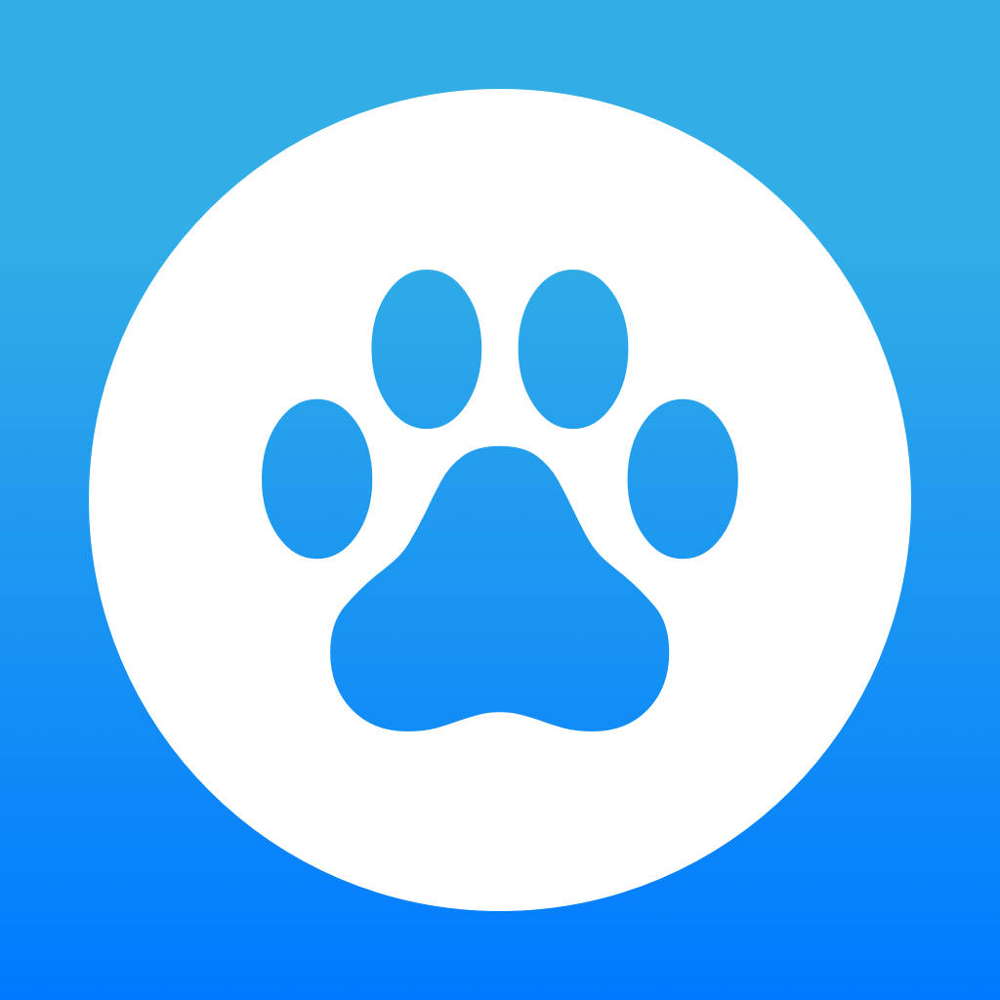
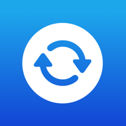

# SwiftUI Learning Journey

  
   
  <em>A collection of SwiftUI projects showcasing iOS development skills</em>

This repository contains all the projects I completed while learning SwiftUI. Each project explores different aspects of SwiftUI development, from basic concepts to more advanced features.

## Projects Overview

### 📱 Core Apps

  
  
  
  
  
  

- **[ChatBot](./ChatBot/)** - A conversational chatbot interface
- **[Grocery List](./Grocery%20List/)**  - A grocery shopping list app with SwiftData
- **[Hike App](./Hike-App/)**  - An outdoor hiking companion app
- **[Paws App](./Paws-App/)**  - A pet management application
- **[Restart App](./Restart-App/)**  - An onboarding and restart experience app
- **[Watchlist App](./Watchlist-App/)**  - A movie watchlist tracker
- **[Wishlist App](./Wishlist-App/)**  - A personal wishlist manager

### 🎯 Fundamentals

- **[SwiftUIBasics](./SwiftUIBasics/)** - Foundation concepts and basic SwiftUI components

## Structure

Each project folder contains:

- **Students/** - Working/learning versions
- **Completed/** - Final implementations
- **Resources/** - Assets, icons, and supporting materials
- **README.txt** - Project-specific documentation

## Learning Focus

These projects cover key SwiftUI concepts including:

- Declarative UI development
- State management
- Navigation and routing
- Data persistence with SwiftData
- Custom components and views
- Animations and transitions
- App architecture patterns

## Getting Started

Each project is self-contained and can be opened independently in Xcode. Navigate to any project's `.xcodeproj` file to get started.

---

_Built with SwiftUI for iOS development learning_
